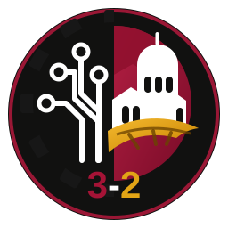

<p align="center">
  
</p>

<h1 align="center">Oberlin 3-2 Engineering Society</h1>
<p align="center"><strong>Connect. Prepare. Build.</strong></p>

A custom, responsive website for Oberlin’s student-led engineering community. It connects current and prospective 3-2 students with project teams, academic planning resources, leadership opportunities, panels, mentorship, events, plus a clearly labeled future engineering challenge concept.

## What is included

- Fifteen public pages: home, about, 3-2 pathway, projects, competition, leadership, events, opportunities, resources, impact, join, contact, media kit, privacy, and a custom 404 page
- Searchable project, event, opportunity, and resource content
- Responsive navigation, global search, filters, dialogs, forms, motion, reduced-motion support, and keyboard focus states
- Versioned JSON content fallbacks so the public site works without a database
- Optional Supabase content system with authentication, row-level security, media storage, public submissions, and an administrative command center; the public site remains fully functional without it
- PWA manifest, service worker, icons, Open Graph art, structured data, sitemap, robots file, and custom-domain configuration
- Automated build, validation, and GitHub Pages deployment

## Local development

Requirements: Python 3.10 or newer and Node.js 18 or newer. The release validator uses Node.js to syntax-check every deployable JavaScript file.

```bash
python scripts/build.py
python scripts/check_site.py
python -m http.server 8000 --directory site
```

Open `http://localhost:8000`.

## Repository structure

| Path | Purpose |
| --- | --- |
| `src/pages/` | Public page bodies |
| `src/partials/` | Shared navigation and footer |
| `src/templates/` | Base document template |
| `src/assets/` | CSS, JavaScript, logo, icons, and social artwork |
| `src/admin/` | Optional content-management interface |
| `content/` | Versioned public content and offline fallbacks |
| `database/` | Supabase schema and starter content |
| `scripts/build.py` | Produces the deployable `site/` directory |
| `scripts/check_site.py` | Validates content, links, HTML, JavaScript, security, and release files |
| `site/` | Generated GitHub Pages artifact |

## Routine content updates

Most updates can be made in `content/*.json`. After editing:

```bash
python scripts/build.py
python scripts/check_site.py
```

The JSON files remain the public fallback even after Supabase is connected. See `docs/CONTENT_GUIDE.md` for field-level guidance.

## Administration

The public site is complete without Supabase. Connecting Supabase enables the secure `/admin/` command center and database-backed submissions. Follow `docs/ADMIN_SETUP.md`; never place a service secret, database password, or private student information in this repository.

## Deployment and domain

Every push to `main` builds, validates, and deploys the `site/` directory through GitHub Pages. The generated `CNAME` is configured for:

`oberlin32engineeringsociety.com`

See `docs/DOMAIN_SETUP.md` for the one-time DNS and Pages settings.

## Accuracy and status

The site distinguishes planned programs from confirmed dates and avoids presenting tentative funding, partnerships, rooms, speakers, or awards as finalized. Formal 3-2 requirements should always be checked against Oberlin College and the relevant engineering institution.

## License

The code is available under the MIT License. The society name, logo, and original brand assets may not be used to imply endorsement or affiliation without permission.
